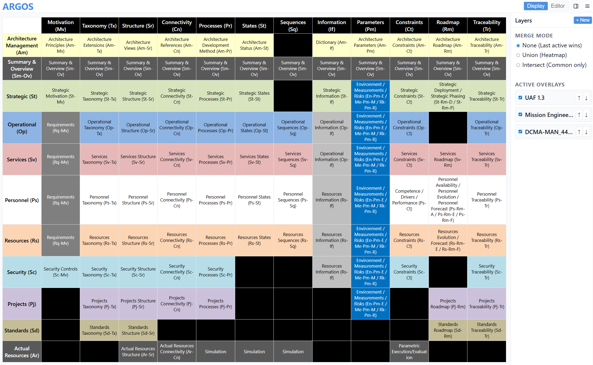
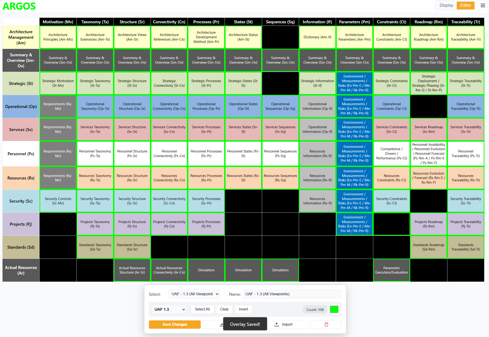

# ARGOS: Architecture Repository for Governance & Operational Standards

**ARGOS** is a Single Page Application (SPA) designed to support organizations in managing, governing, and analyzing architectural frameworks. It primarily targets the Object Managment Group's **Unified Architecture Framework (UAF)** but provides robust capabilities to view custom subsets of the UAF viewpoints, define custom model frameworks, mapping other frameworks (like DoDAF) to UAF, and performing comparative analysis through a system of "Overlays" and "Merge Modes."

README updated since v1.0.4.

## Table of Contents
1. [Background & Intent](#background--intent)
2. [Core Concepts](#core-concepts)
    - [The Grid](#the-grid)
    - [Modes: Display vs. Overlay](#modes-display-vs-overlay)
    - [Layers](#layers)
3. [Features Guide](#features-guide)
    - [Model Management](#model-management)
    - [Overlay Editor](#overlay-editor)
    - [Analysis & Merge Modes](#analysis--merge-modes)
    - [Settings & Customization](#settings--customization)
4. [Tutorial & Walkthrough](#tutorial--walkthrough)

---

## Background & Intent

Modern Systems Engineering requires strict governance over which architectural "views" or "viewpoints" are required for specific projects. However, frameworks like UAF 1.3 are vast, containing extensive grids of view specifications (Taxonomy, Structure, Connectivity, etc. across various Domains).

**ARGOS** was built to solve three specific challenges:
1. **Governance**: Defining specific subsets (Overlays) of the UAF grid that a project is required to fulfill (e.g., "Minimum Viable View," "Security Compliance View").
2. **Mapping**: The ability to import or define non-UAF models (such as DoDAF or custom internal frameworks) and map them visually onto the UAF structure.
3. **Analysis**: Comparing multiple overlays simultaneously to identify gaps, overlaps, or conflicts using boolean logic (Union, Intersection, Difference) and Heatmaps.

---

## Core Concepts

### The Grid
The central interface is the **Architecture Grid**. By default, this represents **UAF 1.3**, featuring Domains (Rows like *Strategic*, *Operational*, *Resources*) and Model Kinds (Columns like *Taxonomy*, *Structure*, *Connectivity*).

ARGOS allows you to swap this underlying grid for **Custom Models**, enabling flexible analysis beyond standard UAF.

### Modes: Display vs. Editor
The application operates in two distinct modes:

* **Display Mode**: The default consumption mode. It allows you to toggle layers on/off, reorder them, and apply Merge Modes to analyze the combined result. The grid is static here; you are "viewing" the composite data.
* **Editor Mode**: An **Overlay** is simply a saved selection of cells (views). The Editor Mode enables the creation or editing of overlays. Here, the grid becomes interactive. Clicking cells "selects" them. You use this mode to define new governance views or map requirements.

### Layers
 In the sidebar, the Overlays are treated as **Layers**, similar to image editing software (like Photoshop). You can stack them, hide them, and reorder them to change which layer takes precedence (visually) or how they interact mathematically.

---

## Features Guide

### Model Management
ARGOS is not limited to UAF.
* **Active Model**: Toggle between UAF 1.3 and any custom models you've created via the dropdown in the HUD or Settings.
* **Model Editor**: Accessible via the Settings menu, this powerful tool allows you to:
    * **Clone** existing models (e.g., Make a copy of UAF to tweak terminology).
    * **Create Blank** grids for entirely new frameworks.
    * **Edit Labels**: Click any cell in the editor to rename headers or row labels.

### Overlay Editor
Activated by the "Editor" toggle.
* **HUD (Heads Up Display)**: A floating control panel appears at the bottom of the screen.
* **Cell Left-Click/Tap (Touchscreens)**: Toggle a single cell.
* **Overlay Selection**: Use the dropdown to select existing overlays to edit or create new ones.
  * **Name**: Assign a meaningful name to your overlay. 
* **Model Selection**: Choose which model (UAF or custom) this overlay applies to.
* **Cell Selection Tools**:
    * **Select All**: Selects the entire grid.
    * **Clear**: Resets all selections.
    * **Invert**: Flips the selection, selecting all unselected cells and deselecting all selected cells.
* **Cell Highlight Color Picker**: Choose the color that will represent selected cells in this overlay.
* **Save Overlay**: Commits your changes to the overlay. It will now appear as a layer in Display Mode.
* **Import/Export**: Save or load specific Overlays as JSON files for sharing or backup.
* **Delete Overlay**: Permanently removes the current overlay from your workspace.

### Analysis & Merge Modes
This is the powerhouse of ARGOS. Located in the **Settings Menu**, the **Merge Mode** determines how visible layers are combined.

* **None (Normal Stacking)**: The top-most visible layer decides the color/presence of a cell. 
* **Intersection (AND)**: Highlights ONLY cells that exist in **ALL** currently visible layers. Useful for finding common requirements across multiple stakeholder views.
* **Union (OR)**: Highlights cells that exist in **ANY** visible layer. Useful for seeing the "Total Scope" of work.
* **Difference (Top - Rest)**: Highlights cells present in the **Top** layer but **NOT** in any other visible layer. Essential for Gap Analysis (e.g., "What does this new requirement add that we don't already have?").
* **Heatmap**: Ignores layer colors and applies a color scale (Blue -> Orange -> Red -> Pink) based on how many layers claim a specific cell. Perfect for identifying "Hotspots" or heavily regulated architectural views.

### Settings & Customization
The right-hand drawer (Hamburger menu) contains active runtime configurations:
* **Global Settings**:
    * **Theme**: Toggle Light/Dark mode.
    * **Font Size**: Adjust grid readability.
    * **Cell Text Alignment**: Control text positioning (Center, Top-Left, etc.).
* **Data Management**:
    * **Import/Export**: Save your entire workspace (Models + Overlays + Settings) to JSON for backup or sharing.
    * **Image Export**: Download the current grid state as a high-res **PNG** or vector **SVG**.

---

## Tutorial & Walkthrough

### 1. Creating a Governance Overlay (UAF 1.3)
* **Goal**: Create the basic UAF 1.3 Overlay
1. Switch to the **Overlay Editor Mode**. (click the orange button "Editor" in the top-right)
2. In the Editor HUD at the bottom
   1. Ensure `Select:` " is set to "Start New..." 
   2. In the `Name:` Field, type: "UAF - 1.3 (All Viewpoints)"
   3. Ensure `Model:` is set to "UAF 1.3"
   4. (Optional) Click the color picker and hight color (e.g., Green <0,255,0>)
   5. Click **Select All** to highlight the entire grid
3. Deselect the empty, or black cells, by left-clicking them
4. Click **Save Changes**
5. Notice the "Overlay Saved!" confirmation at the bottom of the screen
6. Switch back to **Display Mode**, the button left of the "Editor" button in the top-right.

